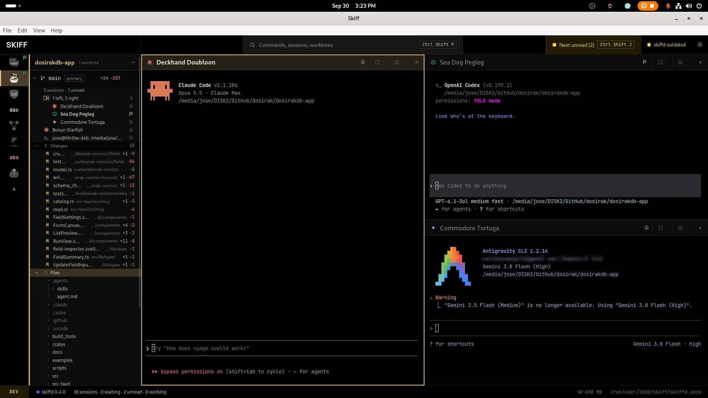

<p align="center"></p>

<h1 align="center">Skiff</h1>

<p align="center">
  <a href="https://github.com/solutionscay/skiff/releases/latest"></a>
  <a href="LICENSE"></a>
  
  
</p>

A minimalist desktop workspace for coding agents on Linux and macOS.

Skiff keeps sessions organized across projects and Git worktrees. Editing and
previews stay in the apps you already use.

<p align="center"></p>

## Philosophy

Skiff has a deliberately small scope: reduce the mental effort of managing
multiple sessions, and use existing apps for the rest.

Project and terminal themes give you a visual cue about where you are. Named
groups and terminal layouts keep related sessions together, so you can arrange
them to suit the work.

## How it works

You add a project (a Git repository), make worktrees in it, and start agent or shell sessions in each worktree. Sessions can sit side by side in a group. Each group has a name and a terminal theme, and so does each project.

Skiff does not edit or preview files. Each worktree lists its changed files, and a double-click shows the diff. Files open in the apps you choose under Settings › Open with (see the [wiki](https://github.com/solutionscay/skiff/wiki/Open-with)). There are no plugins, no hooks into agent configs, and no automations. Settings live in one file, `projects.toml`.

Sessions run in `skiffd`, a daemon that owns every PTY. You can close the window and the agents keep running. When the window opens again, each terminal shows its last screen.

Each session row shows what needs you. A bell means an agent asks for approval. A flag means an agent finished its turn, or a shell command ended, while you were in another pane. `skiffd` reads this from the screen and from the program in front of the terminal, not from hooks. When you come back to a pane, a line marks where you stopped reading.

## Install

Download the latest [release](https://github.com/solutionscay/skiff/releases/latest):

- Linux (x86_64): `.deb`, `.rpm` or AppImage
- macOS (Apple Silicon): `.dmg`, signed and notarized

## Layout

```
crates/skiff-core    session model, wire protocol, projects.toml config
crates/skiffd        daemon: owns every PTY, serves clients over a Unix socket
crates/skiff-client  async client for the socket
apps/desktop         Tauri v2 app, vanilla TypeScript + xterm.js
  src/app            state, actions, keyboard, startup connections
  src/ui             DOM builders, dialogs, menus
  src/workspace      rail, session tree, layouts, files, project actions
  src/terminal       xterm runtime, panes, search, clipboard, font size
  src/appearance     themes, colors, icons, settings
  src/platform       wire types, IPC bytes, file actions
  src/diagnostics    latency traces and memory counts
  src/styles         styles by owner, imported in cascade order
```

## Development

See the [wiki Glossary](https://github.com/solutionscay/skiff/wiki/Glossary) for the terms
this codebase uses for its own screen areas, session-tree contents, and keyboard navigation.

```
cd apps/desktop && pnpm install && pnpm tauri dev
cargo test --workspace
```

`pnpm tauri dev` builds `skiffd` first, then the app, and puts both in `target/debug`.

The app starts `skiffd` on its own when the socket is not there. It looks for the binary
next to its own executable, then on `PATH`. `SKIFF_DAEMON` overrides. `SKIFF_SOCKET`
overrides the socket path, `SKIFF_CONFIG` the config file.

### Changes to skiffd

The daemon outlives the app. A rebuild does not replace the daemon that is running,
so a change to `crates/skiffd` has no effect until you restart it:

```
cargo build -p skiffd      # pnpm tauri dev also does this
pkill -x skiffd            # ends every open session
```

Then reload the window (Ctrl+R) or restart the app. The app starts the new binary
on its next call.

skiffd has its own version (`crates/skiffd` and `crates/skiff-core`), apart from the
app version. At launch the app compares the running daemon's version and protocol
(`skiff_core::PROTOCOL`) with the skiffd it ships. It replaces an older or incompatible daemon without asking when no
session is live. When sessions are live, it shows a "Restart skiffd" button instead.

Debug builds use `skiffd-dev.sock` and `workspace-dev.json`, so `pnpm tauri dev` runs
its own daemon beside the installed app. The daemon writes its log next to the socket
(`skiffd.log` or `skiffd-dev.log`), which is `$XDG_RUNTIME_DIR/skiff/` on Linux.

## Packages

```
cd apps/desktop && pnpm bundle   # packages for the host OS, with skiffd inside
```

On Linux this makes `.deb`, `.rpm` and AppImage. On macOS it makes `Skiff.app` and a `.dmg`.
Packages land in `target/release/bundle/`.

A `v*` tag builds every package in CI and attaches them to a draft release. CI signs and
notarizes the `.dmg` with the `APPLE_*` repository secrets.

## License

MIT

## Social preview

The GitHub social preview image is [`.github/social-preview.png`](.github/social-preview.png).
